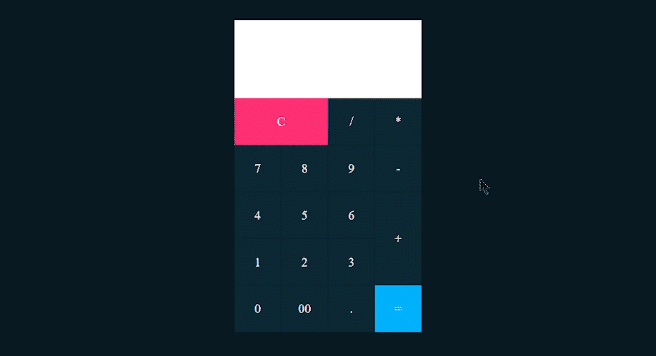

# **CALCULADORA V1**

Este es un modelo de una calculadora, esta realizado principalmente por html y css, aunque tiene algo de javascript incrustado en el html.(basicamente el javascript que tiene son eventos.) 😑

No es muy complicado y viene bien para entender conceptos basicos. 👍
